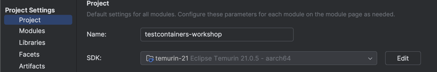
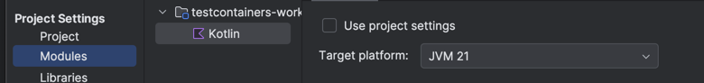

# Testcontainers workshop

This workshop aims to introduce the concept of testcontainers in code. 

**Citation from the Testcontainers website**
_Testcontainers is an open source framework for provisioning throwaway, on-demand containers for development and testing use cases._

## The goal of this workshop
Give you a rolling start on the concept of a Testcontainer. It just scratches the surface of what you can do, but it will hopefully give you enough insights to start experimenting on your own.


## The parts
1. Development environment setup
1. Verify by running the app
1. Set up whats needed for a Testcontainer setup
1. Run your first Testcontainer
1. Use the container in a test with a database

### 1. Development environment

Install Homebrew
```shell 
/bin/bash -c "$(curl -fsSL https://raw.githubusercontent.com/Homebrew/install/HEAD/install.sh)"
```

Then install Maven
```shell
brew install maven
```

**Unlock Mac with the Priveleges app before next step**

We will need to propertly manage our Java environment. Jenv does that pretty well:
```shell
brew install jenv
```

Do as you are asked by Jenv, add the following lines to `~/.zshrc`:
```shell
  export PATH="$HOME/.jenv/bin:$PATH"
  eval "$(jenv init -)"
```

We need Java 21, using the Temurin Project
```shell
brew install temurin@21
```

Add Java 21 to your jenv
```shell
jenv add /Library/Java/JavaVirtualMachines/temurin-21.jdk/Contents/Home
```

Make Maven respect the Jenv plugin
```shell
jenv enable-plugin maven
jenv enable-plugin export
```

Set Java 21 as current local Java version
```shell
jenv local 21
```

Sometimes Intellij IDEA messes up which Java version it uses. Make it use Java 21 for the project. 


Go to project structure (`cmd + ;`) and set:
- Project SDK to _Temurin 21_ previously installed

   
- Module target platform to it to _JVM 21_:


All is fine and dandy if the following works and you get no errors when building from console
```shell
mvn clean install
```

## Task 1 - setting up testcontainers

We have test to verify that we can get data from the database. You can find it in [DatabaseTest.kt](src/test/kotlin/no/sjafjell/devex/testcontainersworkshop/DatabaseTest.kt). 

**Your job is to make sure that the test goes green ✅**

### Step 1 - Add proper dependencies

Testcontainers is essentially a bunch of dependencies that we sprinkle onto Spring. Add these to the pom of the project:

```xml
<dependencies>
    ...
    <dependency>
        <groupId>org.testcontainers</groupId>
        <artifactId>testcontainers</artifactId>
        <version>1.20.1</version>
        <scope>test</scope>
    </dependency>
    
    <dependency>
        <groupId>org.testcontainers</groupId>
        <artifactId>mssqlserver</artifactId>
        <version>1.20.1</version>
        <scope>test</scope>
    </dependency>
    
    <dependency>
        <groupId>com.microsoft.sqlserver</groupId>
        <artifactId>mssql-jdbc</artifactId>
        <version>12.2.0.jre11</version>
    </dependency>
</dependencies>

```

What this gives us is:
- The dependency of Testcontainers itself
- The dependency that enables us connect to a Microsoft SQL server with Testcontainer code
- The database driver that enables us to query the database with Microsoft SQL syntax


