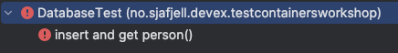
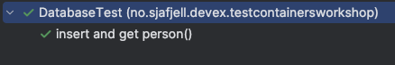

# Testcontainers workshop

This workshop aims to introduce the concept of testcontainers in code. 

**Citation from the Testcontainers website**
_Testcontainers is an open source framework for provisioning throwaway, on-demand containers for development and testing use cases._

## The goal of this workshop
Give you a rolling start on the concept of a Testcontainer. It just scratches the surface of what you can do, but it will hopefully give you enough insights to start experimenting on your own. 

**The goal of this workshop is to make sure that [this test](src/test/kotlin/no/sjafjell/devex/testcontainersworkshop/DatabaseTest.kt) goes green ✅**

The steps of this workshop is as following:

1. Development environment setup
1. Verify that the app builds
1. Add dependencies
1. Make the test run, but fail
1. Start the test container
1. Create a connection to the database
1. Celebrate

## 1. Development environment setup

Install Homebrew
```shell 
/bin/bash -c "$(curl -fsSL https://raw.githubusercontent.com/Homebrew/install/HEAD/install.sh)"
```

Then install Maven
```shell
brew install maven
```

**Unlock Mac with the Priveleges app before next step**

We will need to propertly manage our Java environment. Jenv does that pretty well:
```shell
brew install jenv
```

Do as you are asked by Jenv, add the following lines to `~/.zshrc`:
```shell
  export PATH="$HOME/.jenv/bin:$PATH"
  eval "$(jenv init -)"
```

We need Java 21, using the Temurin Project
```shell
brew install temurin@21
```

Add Java 21 to your jenv
```shell
jenv add /Library/Java/JavaVirtualMachines/temurin-21.jdk/Contents/Home
```

Make Maven respect the Jenv plugin
```shell
jenv enable-plugin maven
jenv enable-plugin export
```

Set Java 21 as current local Java version
```shell
jenv local 21
```

Sometimes Intellij IDEA messes up which Java version it uses. Make it use Java 21 for the project.

Go to project structure (`cmd + ;`) and set:
- Project SDK to _Temurin 21_ previously installed

   
- Module target platform to it to _JVM 21_:


## 2. Verify that the app builds

All is fine and dandy if the following works and you get no errors when building from console
```shell
mvn clean install
```

If not, ask your neighbour for help.

## 3. Add dependencies

Testcontainers is essentially a bunch of dependencies that we sprinkle onto Spring. Add these to the pom of the project:

```xml
<dependencies>
    ...
    
    <!--    The dependency of Testcontainers itself    -->
    <dependency>
        <groupId>org.testcontainers</groupId>
        <artifactId>testcontainers</artifactId>
        <version>1.20.1</version>
        <scope>test</scope>
    </dependency>

    <!--    The dependency that enables us connect to a Microsoft SQL server with Testcontainer code    -->
    <dependency>
        <groupId>org.testcontainers</groupId>
        <artifactId>mssqlserver</artifactId>
        <version>1.20.1</version>
        <scope>test</scope>
    </dependency>

    <!--    The database driver that enables us to query the database with Microsoft SQL syntax    -->
    <dependency>
        <groupId>com.microsoft.sqlserver</groupId>
        <artifactId>mssql-jdbc</artifactId>
        <version>12.2.0.jre11</version>
    </dependency>
    
    ...
    
</dependencies>

```

➡️ Re-import Maven dependencies and build again

## 4. Make the test run, but fail
- [TestDataSource.kt](src/test/kotlin/no/sjafjell/devex/testcontainersworkshop/TestDataSource.kt) - uncomment the file
- Open up the [DatabaseTest.kt](src/test/kotlin/no/sjafjell/devex/testcontainersworkshop/DatabaseTest.kt) - uncomment the test
- Run it and see that it fails:  
  

## 5. Start the test container  
In the [TestDataSource.kt](src/test/kotlin/no/sjafjell/devex/testcontainersworkshop/TestDataSource.kt), we need start a container with our database. 

**Add proper code for starting a `MSSQLServerContainer`** with a proper MS SQL image from Docker hub, like _mcr.microsoft.com/mssql/server:2022-latest_.

➡️ Do this by implementing the `createTestcontainerForDatabase` and returning it. Observe that a Docker container is indeed starting

**Remember to accept the licence** - see more information at the [Testcontainers module page](https://java.testcontainers.org/modules/databases/mssqlserver/)

## 6. Create a connection to the database

We now need to connect to the database.  

➡️ Implement `createDataSource` by instantiationg a `DriverManagerDataSource with the connection details from the database and return it.

Run the test, if it is green, you have successfully created your (first?) test using Testcontainers.



## 7. Celebrate 🎉 

You are now certified as _"I know enough about testcontainers to brag about it in awkward social settings"_.

